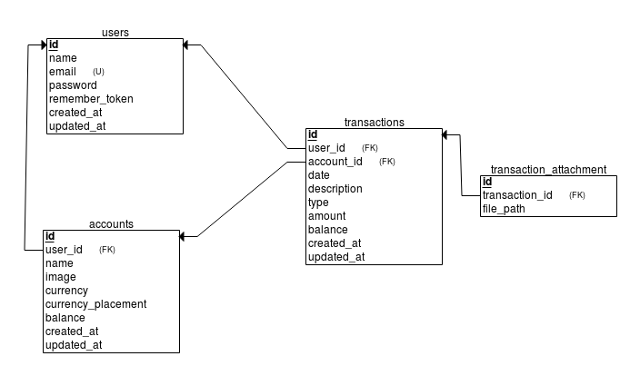

# DompetKu

<p align="center">
<a href="https://travis-ci.org/azishapidin/dompetku"></a>
<a href="https://styleci.io/repos/127994456"></a>
</p>

## About DompetKu

DompetKu is Open Source CMS Cashflow Management, build with Laravel Framework 5.6 (PHP).

Because this apps is build with Laravel 5.6, the requirements is same with Laravel 5.6 requirements.

### Requirements:

- Git (for clone this project)
- Composer
- PHP >= 7.1.3
- OpenSSL PHP Extension
- PDO PHP Extension
- Mbstring PHP Extension
- Tokenizer PHP Extension
- XML PHP Extension
- Ctype PHP Extension
- JSON PHP Extension

### Instalation

Clone this repo:
```
git clone https://github.com/azishapidin/dompetku.git
```

After clone the repo, run composer install in your terminal/CMD to resolves and installs all dependencies:

```
composer install
```

Copy **.env.example** to **.env**:

```
cp .env.example .env
```

Next you must generate a random string for our application key:

```
php artisan key:generate
```

Create database and set to database configuration on **.env** file:

```
DB_CONNECTION=mysql
DB_HOST=127.0.0.1
DB_PORT=3306
DB_DATABASE=homestead
DB_USERNAME=homestead
DB_PASSWORD=secret
```

Hola! DompetKu is ready to use!

## Database Relational Schema



## TODO

- [ ] Update Profile.

## License

The DompetKu is open-sourced software licensed under the [Creative Commons Attribution NonCommercial (CC-BY-NC)](https://tldrlegal.com/license/creative-commons-attribution-noncommercial-(cc-nc)).

## Contributor

Author: [Azis Hapidin](https://azishapidin.com/) 