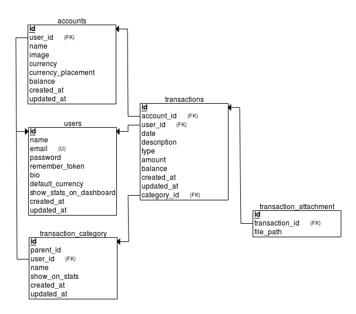

## About DompetKu

DompetKu is Open Source CMS Cashflow Management for multiple users and multiple Accounts, build with Laravel Framework (PHP).

## Database Relational Schema

## TODO

- [x] Add Frontend Template.
- [x] Create Model and Migration.
- [x] Install Authentication (Register, Login, Forgot Password, Reset Password).
- [x] Templating Authentication.
- [x] Create Builder Income and Expenses.
- [x] CRUD Accounts.
- [x] Form Add Income and Expenses data.
- [x] Transaction Category.
- [x] List Data Income and Expenses.
- [x] Account Settings.
- [x] Statistics.
- [ ] Update Profile.

## License

The DompetKu is open-sourced software licensed under the [Creative Commons Attribution NonCommercial (CC-BY-NC)](https://tldrlegal.com/license/creative-commons-attribution-noncommercial-(cc-nc)).

## Contributor

Author: [Azis Hapidin](https://azishapidin.com/) 
